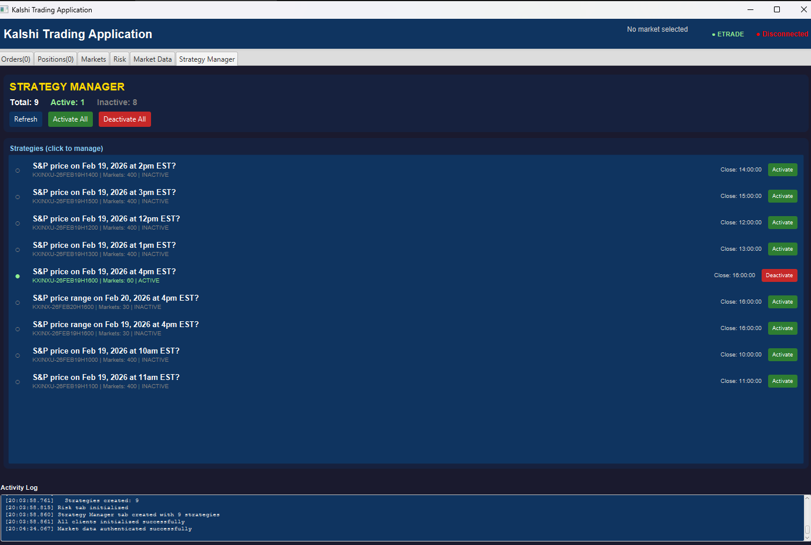
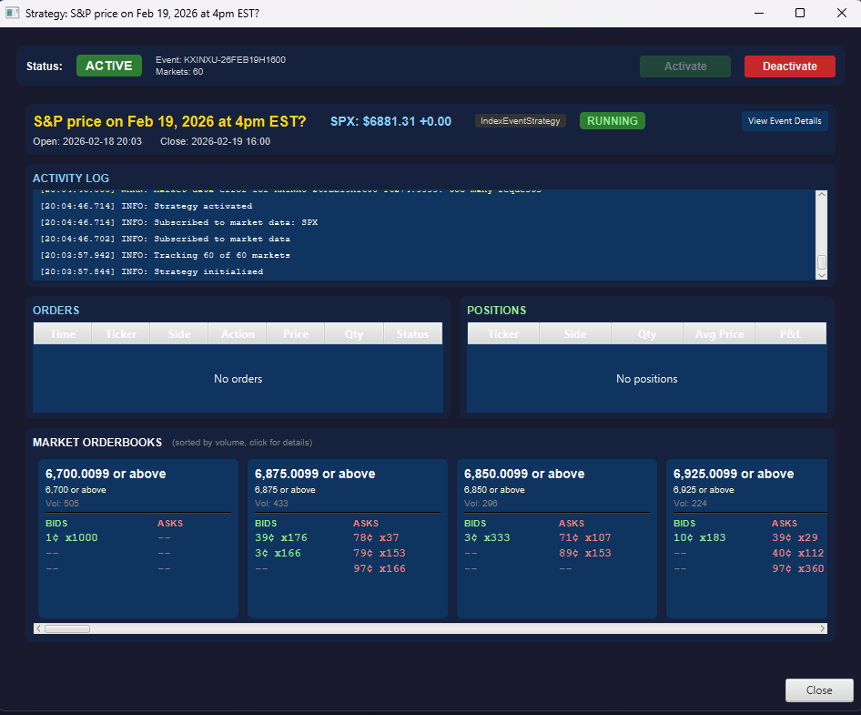
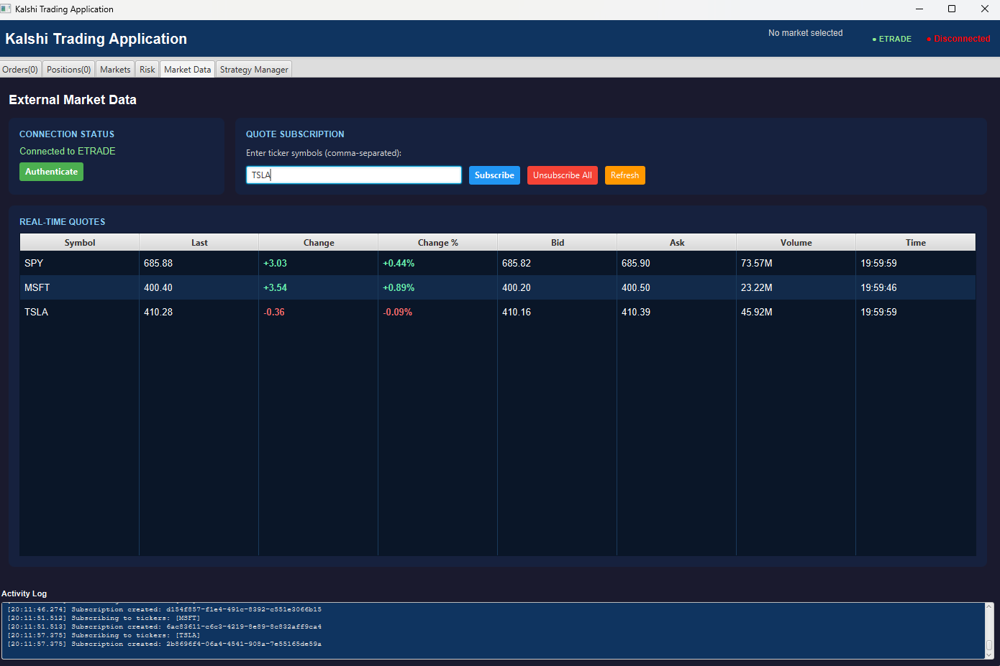

# predictionInfra

A multi-module Java infrastructure platform for building, deploying, and managing automated trading strategies on prediction markets. Designed for [Kalshi](https://kalshi.com/) event contracts with optional real-time equity market data from [E*TRADE](https://developer.etrade.com/).

## Overview

predictionInfra provides a complete runtime for prediction market strategy development — from market data ingestion and signal generation to order execution and risk enforcement. Strategies are self-contained units of trading logic that plug into the platform without modifying any framework code. The platform handles API connectivity, market discovery, order routing, position tracking, and risk management.

### Key Capabilities

- **Strategy framework** — extend `EventStrategy`, register via config, and the platform handles discovery, lifecycle, market subscriptions, and risk enforcement
- **Dual-transport order routing** — REST API and FIX protocol (FIXT.1.1 / FIX 5.0 SP2) with automatic failover
- **Real-time market data** via REST polling and WebSocket streaming (orderbook snapshots, deltas, position updates, market lifecycle events)
- **Risk management** — platform-enforced limits on order size, notional, and position exposure with per-strategy overrides
- **Cross-asset data integration** — consume real-time equity quotes from E*TRADE (or other providers) alongside Kalshi event data for signal generation
- **JavaFX dashboard** — live orderbook visualization, strategy management, order/position blotters, and risk configuration

## Screenshots

### Strategy Manager

The main dashboard lists all discovered strategies with their event tickers, market counts, and close times. Strategies can be individually activated/deactivated or controlled in bulk. The activity log streams timestamped system events.



### Strategy Detail

Clicking a strategy opens its detail view showing the event title, live external market data (e.g., SPX price), strategy type, and running status. Below: activity log, order and position blotters, and live orderbooks sorted by volume with bid/ask depth at each price level.



### External Market Data

The Market Data tab connects to E\*TRADE for real-time equity quotes. Strategies consume this data via `getMarketDataManager()` to inform trading decisions on prediction markets.



## Architecture

```
betting-app                     Application layer: demo apps, UI, strategy implementations
    │
    ├── kalshi-fix-transport    FIX protocol transport for low-latency order execution
    ├── kalshi-java-client      Core: API client, strategy framework, risk engine
    ├── etrade-api              E*TRADE client: OAuth 1.0, real-time quotes, subscriptions
    └── marketdata-api          Provider-agnostic interfaces (Quote, MarketDataManager)

etrade-sample-app              Standalone E*TRADE console demo
etrade-javafx-app              Standalone E*TRADE JavaFX demo
```

## Requirements

- Java 17+
- Maven 3.6+

## Quick Start

```bash
# Build and test
mvn clean install

# Run tests only
mvn test
```

### API Credentials

**Kalshi** — generate an API key at [kalshi.com/settings/api](https://kalshi.com/settings/api). Configure in `strategy.properties`:

```properties
api.keyId=your-key-id
api.privateKeyFile=path/to/private_key.pem
api.useDemo=true    # use demo environment for testing
```

Or via environment variables: `KALSHI_API_KEY_ID`, `KALSHI_PRIVATE_KEY_FILE`.

**E*TRADE** — register at the [E*TRADE Developer Portal](https://developer.etrade.com/) and configure `etrade-config.properties`:

```properties
consumer.key=your-consumer-key
consumer.secret=your-consumer-secret
use.sandbox=true
```

## Strategy Framework

The platform's core design principle is that **strategies are self-contained units of trading logic** that plug into the runtime without modifying any framework code. The platform manages everything else: API connectivity, market data subscriptions, order routing, position tracking, and risk enforcement.

### How It Works

1. **Write a strategy class** that extends `EventStrategy`
2. **Set the class name** in `strategy.properties`
3. **Run the app** — `StrategyLauncher` discovers your class via reflection, creates instances per matched event, wires up all services, and manages the full lifecycle

### Strategy Lifecycle

```
StrategyLauncher reads strategy.properties
        │
        ▼
EventFilter scans series → filters events by date, category, title
        │
        ▼
For each matching event:
    Strategy class instantiated via reflection (constructor takes event ticker)
        │
        ▼
    initialize() wires in KalshiApi, OrderManager, PositionManager, MarketManager
        │
        ▼
    onInitialized() → loads event, filters markets via shouldTrackMarket()
        │
        ▼
    makeActive() → subscribes to market data, starts timer
        │
        ▼
    Running: onTimer(), onMarketDataUpdate(), onOrderCreated(), onPositionUpdated()...
        │
        ▼
    shutdown() → unsubscribes, stops timer, cleanup
```

### Writing a Strategy

Extend `EventStrategy` and override the hooks you need:

```java
public class MyStrategy extends EventStrategy {

    public MyStrategy(String eventTicker) {
        super(eventTicker);
    }

    @Override
    protected boolean shouldTrackMarket(Market market) {
        return "active".equalsIgnoreCase(market.getStatus())
            && market.getVolume24h() > 100;
    }

    @Override
    protected void onStrategyReady() {
        makeActive();
    }

    @Override
    protected void onMarketDataUpdate(ManagedMarket market) {
        Integer bid = market.getBestYesBid();
        Integer ask = market.getBestYesAsk();
    }

    @Override
    public void onTimer() {
        for (ManagedMarket m : getTrackedMarkets()) {
            if (m.getYesSpread() != null && m.getYesSpread() > 5) {
                buy(m.getTicker(), "yes", 1, m.getBestYesBid() + 1);
            }
        }
    }

    @Override
    public void onOrderCreated(Order order) { /* ... */ }

    @Override
    public void onPositionUpdated(Position position) { /* ... */ }
}
```

Register it in `strategy.properties`:

```properties
strategy.class=com.example.MyStrategy
series.tickers=KXINX,KXINXU
strategy.maxStrategies=10
strategy.timerIntervalSeconds=10
```

### Lifecycle Hooks

| Hook | When it fires |
|------|--------------|
| `onStrategyReady()` | After event loaded and markets filtered (inactive state) |
| `onActivated()` / `onDeactivated()` | When `makeActive()` / `makeInactive()` is called |
| `onTimer()` | Every N seconds (configurable) |
| `onMarketDataUpdate(ManagedMarket)` | Orderbook snapshot or delta received |
| `onMarketInfoUpdate(ManagedMarket)` | Market metadata updated via REST |
| `onOrderCreated/Modified/Removed(Order)` | Order lifecycle events |
| `onPositionOpened/Updated/Closed(Position)` | Position lifecycle events |
| `onMarketDataConnected/Disconnected()` | WebSocket connection state changes |
| `onShutdown()` | Application shutting down |

### Services Available to Strategies

- **`getApi()`** — full Kalshi API access (series, events, markets, orders)
- **`getOrderService()`** — order operations with `buy()`, `sell()`, `cancelOrder()` helpers
- **`getOrderManager()`** / **`getPositionManager()`** — live order and position state
- **`getMarketManager()`** — live orderbook data for subscribed markets
- **`getMarketDataManager()`** — external market data (E*TRADE quotes) if configured
- **`logActivity()`** / **`logTrade()`** — structured logging that feeds the UI activity panel
- **`setDisplayMarkets()`** — control which markets appear in the UI orderbook panel
- **`setMarketDataLabel()`** — display real-time info in the UI header

## Risk Management

Risk limits are enforced at the platform level — strategies cannot bypass them. Configure global limits and per-strategy overrides in `strategy.properties`:

```properties
# Global limits
risk.enabled=true
risk.maxOrderQuantity=50
risk.maxOrderNotional=2500       # in cents ($25.00)
risk.maxPositionQuantity=200
risk.maxPositionNotional=10000   # in cents ($100.00)

# Per-strategy overrides
risk.strategy.MyStrategy.maxOrderQuantity=25
risk.strategy.AggressiveBot.maxOrderQuantity=100
```

Orders that violate limits throw `RiskCheckException` with details about the violation.

## Event Filtering

The `EventFilter` automatically discovers tradeable events from configured series tickers:

```properties
series.tickers=KXINX,KXINXU
filter.minStrikeDateHours=2       # skip events expiring too soon
filter.maxStrikeDateDays=7        # skip far-future events
filter.category=Financials
filter.titleContains=S&P
filter.mutuallyExclusive=true
filter.parallelThreads=4
```

## Order Transport

Orders are routed through a pluggable `OrderTransport` interface. Strategies call `buy()`, `sell()`, `cancelOrder()`, and `amendOrder()` as normal — the transport layer is transparent.

### Transport Modes

| Mode | Description |
|------|-------------|
| `rest` | REST API only (default). All orders sent via HTTPS. |
| `fix` | FIX protocol only. Orders sent as FIX messages over a persistent TLS session. Fails if disconnected. |
| `fix-with-rest-fallback` | FIX when connected, automatic REST fallback when FIX is unavailable. |

### Order Flow

```
Strategy.buy() / sell() / cancelOrder() / amendOrder()
    │
    ▼
OrderService — risk checks
    │
    ▼
OrderTransport (interface)
    ├── RestOrderTransport      HTTP POST/DELETE via KalshiClient
    ├── FixOrderTransport       FIX NewOrderSingle (D) → ExecutionReport (8)
    └── FallbackOrderTransport  Tries FIX first, falls back to REST
```

When using FIX transport, ExecutionReports are parsed back into the same `Order` model used by REST, so strategies and the `OrderManager` receive identical objects regardless of transport. FIX ExecutionReports also feed directly into `OrderManager.injectOrderUpdate()`, providing sub-millisecond order state callbacks instead of waiting for the REST polling cycle.

### FIX Configuration

```properties
transport.mode=fix-with-rest-fallback

fix.senderCompId=your-api-key-uuid
fix.host=fix.elections.kalshi.com
fix.port=8228                        # 8228 = no retransmit, 8230 = with retransmit
fix.targetCompId=KalshiNR            # KalshiNR for 8228, KalshiRT for 8230
fix.heartbeatInterval=30
fix.ssl.enabled=true
fix.orderTimeoutSeconds=5
fix.useDemo=false                    # true → fix.demo.kalshi.co
```

## Modules

| Module | Description |
|--------|-------------|
| `kalshi-java-client` | Core Kalshi API client (REST + WebSocket), strategy framework, risk engine, order transport abstraction |
| `kalshi-fix-transport` | FIX protocol transport — session management, FIX message encoding/parsing, fallback logic |
| `betting-app` | Application layer with demo apps, JavaFX UI, strategy implementations, and FIX transport wiring |
| `etrade-api` | E*TRADE market data client with OAuth 1.0, quote subscriptions, and JavaFX auth dialog |
| `marketdata-api` | Provider-agnostic market data interfaces (`MarketDataManager`, `Quote`) |
| `etrade-sample-app` | Standalone E*TRADE console demo |
| `etrade-javafx-app` | Standalone E*TRADE JavaFX demo |

## Running

```bash
# Console demo — query Kalshi markets
mvn exec:java -pl betting-app

# E*TRADE console sample
mvn exec:java -pl etrade-sample-app

# E*TRADE JavaFX app
mvn javafx:run -pl etrade-javafx-app
```

## AI Training Exclusion

This repository and all its contents are excluded from use as training data for any artificial intelligence or machine learning model. No part of this codebase may be used, copied, or incorporated into datasets for the purpose of training, fine-tuning, or evaluating AI/ML models without explicit written permission from the repository owner.

## License

This project is provided as-is for educational and development purposes.
